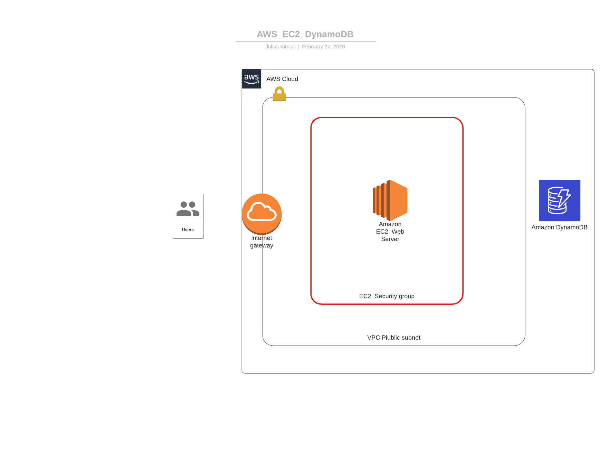

##My Phonebook Application - Udacity Cloud DevOps Course Demo Project

A basic web application with CRUD REST API Flask backend and a React SPA frontend. The datastore 
for the application is implemented with Amazon DynamoDB

###Application Architecture

###API Endpoints:

* /api/persons -  Returns all people in my phonebook implemented as an Amazon DynamoDB table. Consumed by the React frontend using Axios. This route is also used to post an entry into the phonebook using the method POST

* /api/persons/&lt;id&gt; - Used to update an existing entry in the phonebook using HTTP PUT method

* /api/persons/&lt;id&gt; - Used to delete an entry from the phonebook using HTTP DELETE method

Live demo available [here](http://ec2-54-167-252-171.compute-1.amazonaws.com/)

